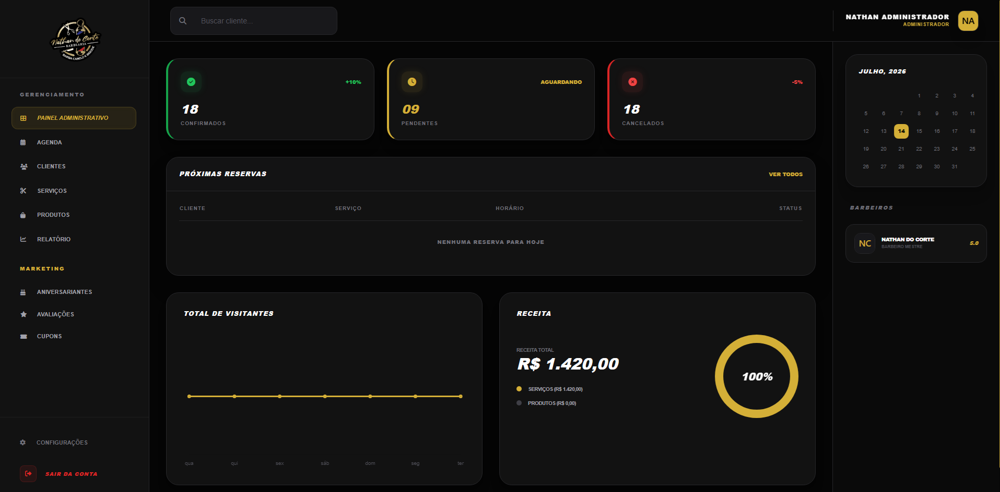

<<<<<<< HEAD
<p align="center">
  
</p>

<h1 align="center">Nathan do Corte — Plataforma SaaS para Barbearia</h1>

<p align="center">
  Sistema web completo com agendamento online, painel administrativo e integração com Mercado Pago.
  <br/>
  Desenvolvido para a barbearia Nathan do Corte, em Cascavel, CE.
</p>

<p align="center">
  <a href="https://nathandocorte.com" target="_blank">🌐 Site Oficial</a> &nbsp;|&nbsp;
  <a href="https://demo.nathandocorte.com" target="_blank">🧪 Versão Demo</a>
</p>

---

## 🔐 Acesso à Demo

| Campo | Valor |
|-------|-------|
| **URL** | https://demo.nathandocorte.com/admin |
| **E-mail** | recrutador@demo.nathandocorte.com |
| **Senha** | demo2026 |

> ⚠️ **Observação:** Fique à vontade para explorar todas as funcionalidades do painel administrativo. O sistema é restaurado automaticamente a cada 10 segundos após qualquer alteração, garantindo que outros recrutadores também possam avaliar o projeto no estado original.

---

## 🖥️ Landing Page


---

## 📊 Painel Administrativo



---

## 📈 Resultados

- ✅ Único barbeiro de Cascavel, CE com site próprio e agendamento digital
- ✅ Mais de **50 agendamentos** registrados no sistema no primeiro mês
- ✅ Controle total da agenda sem depender do WhatsApp manual
- ✅ Perfil verificado no **Google Meu Negócio** com indexação local
- ✅ Receita de **R$ 1.890,00** rastreada e registrada no sistema no primeiro mês

---

## ⚙️ Funcionalidades

### 🗓️ Agendamento Online
- Agendamento sem necessidade de login (cliente preenche nome, telefone e data de nascimento)
- Seleção de até 3 serviços por agendamento
- Escolha de data e horário com disponibilidade em tempo real
- Pagamento de sinal (R$ 5,00) ou valor total via **Pix** integrado ao Mercado Pago
- Contador regressivo de 15 minutos para pagamento — horário liberado automaticamente se não pago
- Campo de cupom de desconto no agendamento

### 👤 Autenticação
- Registro simplificado — campos obrigatórios: nome, telefone e senha
- Login por **e-mail ou telefone**
- Usuários com conta pulam o formulário no agendamento

### 📋 Painel Administrativo
- **Dashboard** com métricas em tempo real: confirmados, pendentes, cancelados e receita
- **Agenda** com visualização diária, agendamento avulso (walk-in) e controle de status
- **Clientes** com histórico de atendimentos, busca por nome e atalho para WhatsApp
- **Serviços** com CRUD completo, suporte a promoções e imagens
- **Produtos** com gestão de estoque e registro de vendas
- **Relatórios** com faturamento por período, ticket médio, taxa de no-show e gráficos
- **Aniversariantes** do dia para ações de marketing
- **Avaliações** dos clientes com média geral e filtro por nota
- **Cupons** com CRUD completo — cupons manuais e automáticos, validade e limite de usos

### ⭐ Sistema de Avaliações
- Avaliação com estrelas (1-5) e comentário após pagamento confirmado
- Geração automática de cupom de 5% de desconto após avaliar no Google
- Notas 1 e 2 não entram na média mas aparecem no painel para o administrador
- Média de avaliações exibida na landing page em tempo real
- Botão de WhatsApp para o Nathan solicitar avaliações diretamente aos clientes

### 🎟️ Sistema de Cupons
- Cupons automáticos gerados após avaliação no Google (`AVA-XXXXX`)
- Cupons manuais criados pelo Nathan com código personalizado
- Controle de validade, limite de usos e ativação/desativação
- Desconto aplicável no sinal ou no valor total

### ⏰ Gerenciamento de Horários
- Horários diferenciados por dia da semana
- Sábado: 07:30 — 17:00 (sem pausa para almoço)
- Quarta-feira: encerra às 17:30
- Terça a sexta: 08:30 — 19:00

### 📶 QR Code Wi-Fi
- QR Code no menu mobile com as credenciais da rede Wi-Fi da barbearia
- Cliente conecta sem precisar digitar senha

---

## 🎨 Prototipação

Antes do desenvolvimento, o projeto foi prototipado no Figma e aprovado pelo cliente. O protótipo inclui todas as telas da landing page, fluxo de agendamento e painel administrativo.

👉 [Ver protótipo no Figma](https://www.figma.com/design/vD6Z3Df61YOgirlIscddBH/Nathan-do-Corte?node-id=0-1&p=f&t=qFfflqq2AuQL49NQ-0)

---

## 🛠️ Stack Técnica

| Tecnologia | Uso |
|-----------|-----|
| **Figma** | Prototipação e aprovação do cliente |
| **Laravel 13** | Backend e rotas |
| **Tailwind CSS** | Estilização |
| **Alpine.js** | Interatividade no frontend |
| **MySQL** | Banco de dados |
| **Mercado Pago API** | Geração de Pix e webhooks |
| **Hostinger** | Hospedagem e domínio |
| **Laravel Sail** | Ambiente local com Docker |

---

## 🚀 Instalação Local

```bash
# Clone o repositório
git clone https://github.com/MatheusdePaulo/barbearia-nathan.git
cd barbearia-nathan

# Instale as dependências
composer install
npm install

# Configure o ambiente
cp .env.example .env
php artisan key:generate

# Suba os containers
./vendor/bin/sail up -d

# Rode as migrations e seeders
./vendor/bin/sail artisan migrate
./vendor/bin/sail artisan db:seed --class=ServiceSeeder

# Compile os assets
./vendor/bin/sail npm run dev
```

---

## 📄 Licença

MIT License — © 2026 [Matheus de Paulo](https://matheusdepaulo.com)
=======
<p align="center"><a href="https://laravel.com" target="_blank"></a></p>

<p align="center">
<a href="https://github.com/laravel/framework/actions"></a>
<a href="https://packagist.org/packages/laravel/framework"></a>
<a href="https://packagist.org/packages/laravel/framework"></a>
<a href="https://packagist.org/packages/laravel/framework"></a>
</p>

## About Laravel

Laravel is a web application framework with expressive, elegant syntax. We believe development must be an enjoyable and creative experience to be truly fulfilling. Laravel takes the pain out of development by easing common tasks used in many web projects, such as:

- [Simple, fast routing engine](https://laravel.com/docs/routing).
- [Powerful dependency injection container](https://laravel.com/docs/container).
- Multiple back-ends for [session](https://laravel.com/docs/session) and [cache](https://laravel.com/docs/cache) storage.
- Expressive, intuitive [database ORM](https://laravel.com/docs/eloquent).
- Database agnostic [schema migrations](https://laravel.com/docs/migrations).
- [Robust background job processing](https://laravel.com/docs/queues).
- [Real-time event broadcasting](https://laravel.com/docs/broadcasting).

Laravel is accessible, powerful, and provides tools required for large, robust applications.

## Learning Laravel

Laravel has the most extensive and thorough [documentation](https://laravel.com/docs) and video tutorial library of all modern web application frameworks, making it a breeze to get started with the framework.

In addition, [Laracasts](https://laracasts.com) contains thousands of video tutorials on a range of topics including Laravel, modern PHP, unit testing, and JavaScript. Boost your skills by digging into our comprehensive video library.

You can also watch bite-sized lessons with real-world projects on [Laravel Learn](https://laravel.com/learn), where you will be guided through building a Laravel application from scratch while learning PHP fundamentals.

## Agentic Development

Laravel's predictable structure and conventions make it ideal for AI coding agents like Claude Code, Cursor, and GitHub Copilot. Install [Laravel Boost](https://laravel.com/docs/ai) to supercharge your AI workflow:

```bash
composer require laravel/boost --dev

php artisan boost:install
```

Boost provides your agent 15+ tools and skills that help agents build Laravel applications while following best practices.

## Contributing

Thank you for considering contributing to the Laravel framework! The contribution guide can be found in the [Laravel documentation](https://laravel.com/docs/contributions).

## Code of Conduct

In order to ensure that the Laravel community is welcoming to all, please review and abide by the [Code of Conduct](https://laravel.com/docs/contributions#code-of-conduct).

## Security Vulnerabilities

If you discover a security vulnerability within Laravel, please send an e-mail to Taylor Otwell via [taylor@laravel.com](mailto:taylor@laravel.com). All security vulnerabilities will be promptly addressed.

## License

The Laravel framework is open-sourced software licensed under the [MIT license](https://opensource.org/licenses/MIT).
>>>>>>> 7ac70fc7c47d14397d5b84571e95502c306b785b
